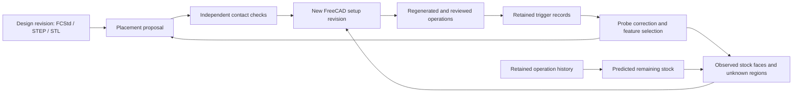

# Probe-based positioning and manufacturing continuation

Probe measurements and an STL can provide a practical basis for locating an existing part, identifying accessible differences from its intended shape, and preparing subsequent manufacturing operations. The first useful implementation is a positional mapper with retained evidence: nominal geometry, actual contacts, a proposed placement, independent checks, and an explicit description of what remains unmeasured. Automatically selecting a restart line is a separate problem involving the manufacturing process and controller state.

## Manufacturing workflows that already use this idea

Commercial machining systems combine surface inspection with part alignment. Autodesk documents a workflow that creates a machining setup, acquires surface inspection results, calculates an alignment, and incorporates that alignment in the manufacturing process. Supported transformations depend on the machine and postprocessor. This establishes a useful precedent for a DMC2 implementation without requiring a switch from FreeCAD.[^1]

Rest machining addresses material left by earlier operations. Autodesk's adaptive-roughing documentation distinguishes stock sources and previous-operation material. This is a useful conceptual distinction: a predicted stock model comes from the operation history; a measured stock model comes from observations. They may disagree after an interrupted cut, deflection, stock movement, or an incomplete operation.[^2]

FreeCAD has the necessary building blocks for the downstream CAD/CAM side. A CAM Job contains model placement, stock, an operation sequence, tool controllers and postprocessor configuration. Its simulator subtracts the swept cutting-tool geometry from stock and can preserve the resulting simulation object. These are foundations for a measured-setup workflow, rather than evidence that FreeCAD already supplies an automatic DMC2 probe-registration and continuation system.[^3][^4]

The proposed DMC2 loop is:

Every arrow represents a data dependency. It does not authorize a machine action. Measurements used to check a placement stay separate from measurements used to fit it.

## What an STL contributes

STL describes a surface through triangular facets. The ASCII and binary variants retain vertices and facet-normal information; they do not retain a parametric feature tree or manufacturing history. A surface mesh is useful for closest-surface queries, cross sections, nominal extents and collision geometry. The implementation therefore requires an explicit conversion from STL coordinate units to millimetres instead of inferring scale from apparent size.[^5]

A native FreeCAD file remains the preferable source for modifying an existing design because its features and CAM context can be retained. Keep the native document and a derived STL as separate revisions with the same named model frame. An exported STL may include a placement that is already present in the native object: applying the same placement again would transform it twice.

Converting an arbitrary STL back into a FreeCAD solid is possible in suitable cases, but the result can contain a large number of planar faces. FreeCAD's documentation describes direct mesh-to-shape conversion and planar-segment methods, and notes the difficulty of manipulating highly tessellated converted solids. The initial workflow can use STL for registration and native CAD for toolpath regeneration, without requiring this conversion.[^6]

For additive jobs, a saved slicer project is also valuable. 3MF supports units, transformations and additional structured manufacturing information. It does not, by itself, establish which portions of a physical job were actually printed.[^7]

## Four distinct coordinate meanings

| Data | Meaning | Required relationship |
|---|---|---|
| Original trigger XYZ | Exact retained LinuxCNC machine trigger coordinates | Original G38 source and bits |
| Probe ball centre | Geometric position of the ball at contact under a calibration model | Mounting vector and pretravel convention |
| Estimated object surface | Contact surface inferred from ball centre and local normal | Radius and a supported surface normal |
| Design point | A location in a named CAD/STL frame | Proposed model-to-machine rigid transform |

The retained raw trigger coordinates must not be relabelled as surface points. The new implementation uses the explicit equation

`centre_machine = trigger_machine + trigger_to_ball_mm - pretravel_mm × approach_unit`.

The mounting vector maps the retained trigger reference to the geometric ball centre. The pretravel distance accounts for motion along the recorded approach before the trigger. These terms are request inputs, accompanied by calibration and frame references. The example uses synthetic calibration; it is not a source for the installed probe's mounting vector.

For a local outward normal `n`, the inferred surface point is `centre - radius × n`. The approach direction generally is **not** that normal. Subtracting the radius along the approach gives the wrong surface on oblique faces and curved surfaces. With a mesh, the closest surface supplies a candidate normal; its correctness depends on the placement, model geometry and which surface was actually contacted.

Renishaw's calibration material distinguishes the electronic probe length and effective stylus dimensions used in measurement, including pretravel effects. A calibrated effective radius or length can already incorporate an effect that a separate correction would otherwise model. The DMC2 request must document which convention is used so that the effect is not counted twice.[^8]

LinuxCNC machine coordinates, work offsets, local/global offsets and tool compensation also have distinct meanings. Exported measurements already labelled machine coordinates must not receive the work offset a second time. The current positional mapper produces data and never writes a work or tool offset.[^9]

## Registration: the calculation and its limits

The new solver implements a local sphere-to-STL fit. Given an initial model-to-machine placement, it transforms corrected ball centres into model coordinates, finds their nearest triangle surfaces, compares the locally signed distance with the ball radius, and minimizes those residuals. A robust Huber weight reduces the influence of an unusually large residual while retaining the row, residual and weight in the output.

This follows the local-registration structure of correspondence search followed by a pose update. Open3D describes local ICP methods and their dependence on a sufficiently close initial alignment. It also provides global methods that can produce an initial placement before local refinement. Those global methods are a potential extension; they are not implemented by this scaffold.[^10][^11]

The fitting objective is

`sum over fit contacts: Huber(locally_signed_distance(inverse(T) × centre, STL) - radius)`.

For the current implementation, the Huber transition distance, association bound, iteration budget, numerical stopping distance and permitted correction from the initial placement are explicit request values. They are not physical acceptance tolerances. The solver never increases its search bounds automatically. An unassociated fitting point causes an explanatory error instead of silently disappearing from the fit. Robust weighting is consistent with the role of robust kernels in registration, but its scale still needs to match the intended analysis.[^12]

The solver supports:

| Mode | Fitted components | Suitable initial use |
|---|---|---|
| `translation-yaw` | Translation and rotation about the model Z axis | Part seated with a known vertical orientation |
| `rigid` | Translation and all rotational components | Measurements with sufficient independent three-dimensional constraints |

The second mode is not automatically better. A rim acquired at one height and a top contact can support a useful seated-part alignment, while leaving tilt or other components poorly constrained. A cylindrical surface cannot determine rotation around its symmetry axis by itself. A square can have several geometrically indistinguishable orientations. More samples of the same uninformative surface do not resolve those ambiguities.

The numerical solve uses column-scaled, pivoted QR with reorthogonalization. It reports missing rank instead of adding artificial constraints. Its minimum scaled pivot is a conditioning diagnostic, not a measurement uncertainty. Research on ICP observability shows why geometry and the particular residual model matter; a small residual alone is not proof that every placement component is constrained.[^13]

The current implementation does not establish global uniqueness, check mesh self-intersections, calculate a calibrated confidence interval, or resolve symmetries. Its output states those limitations. Consistent outward triangle winding and closed edges are required for fitting, but those checks do not certify that a mesh is a correct physical solid.

## Keeping stock size separate from design placement

A raw block is expected to differ from a finished part. If all its outer faces are fitted to the finished-part mesh, the optimizer may shift or rotate the design in response to intentional machining allowance. Therefore only stable reference geometry belongs in the placement fit. Contacts on unmachined stock belong in the stock measurement set.

The implemented contact roles are `fit`, `check`, `observe`, and the six named stock faces. `check` rows are evaluated after fitting and never influence the fit. Stock-face rows estimate the coordinate of an explicitly identified plane parallel to the corresponding model axis. A face estimate retains its sample count, median, minimum, maximum and spread. Opposing faces yield a size; a missing opposing face leaves that size unknown.

The report calculates each observed face's allowance relative to the corresponding model bound, and records the nominal model span as an ideal prediction of finished size. These are useful inputs for planning a subsequent facing or sizing operation. They do not demonstrate material availability throughout a complex target shape. A bounding box containing the design can still contain a cavity, missing corner or undercut that intersects it.

For early practice, use a cuboid or another object with identifiable stable surfaces. Fit its known datum geometry, then inspect the other faces as measurements. After a relocation, add a new setup and fit a new placement. Reuse design-space feature coordinates; regenerate their machine coordinates from the new placement.

No deformation of the design should be introduced merely to improve agreement. First separate rigid placement, stock variation, probe correction and machine geometry. If repeated, properly referenced observations later support a deformation model, retain it as a separate, named correction with its own evidence and limits.

## What the existing edge and top mapping can contribute

The rim tracer supplies original coarse and fine contacts, approach directions, commanded feeds, release/withdrawal events and a terminal result when one was recorded. Its fine-contact sequence is useful for an observed outline at its actual tracing height. It is not automatically a complete three-dimensional stock model.

A top map supplies surface samples and misses within its search policy. A miss only states that the permitted search did not produce a contact. It cannot be converted into a point at the search floor. An overhang, a narrow slot inaccessible to the ball, or a surface outside the search depth remains unmeasured.

The earlier gauge-block workflow samples sides at different heights, which can add information about local tilt. However, changing height also changes the probing geometry and possible error contributions. Part tilt, face form, probe directional effects and machine-axis geometry can produce similar observations; one fit should not silently assign them all to spindle skew.

The new object-map importer accepts mapper ledgers and retains their exact source payloads. Historical mapper ledgers do not contain a ball diameter in their start record, so their imported nominal diameter is `null`, not a value copied from today's configuration. Analysis requires its own explicit radius and calibration reference.

A preserved partial or failed scan can still be inspected. A partial capture remains marked partial in an analysis. Captures containing an unexpected contact, contact recovery or a recorded missing required trigger remain quarantined and cannot supply fitted geometry through this interface. The importer retains the failure's record, reason and recovery instructions alongside the unchanged ledger. Neither a terminal program result nor a complete-looking contour is automatically accepted as metrology.

## Remaining-material models for later stages

There are several useful representations, each suited to a different question:

| Representation | Useful information | Information it cannot establish alone |
|---|---|---|
| Exact contact ledger | Source observations and acquisition history | Continuous surface or solid occupancy |
| Ordered rim at a stated height | Perimeter samples, local side geometry | Other heights, hidden cavities, bottom surface |
| Top height field with known/unknown mask | Accessible topography | Overhangs and multiple surfaces at one XY |
| Named plane/feature fits | Datums and dimensions with residuals | Unmeasured local defects |
| Mesh or voxel stock estimate | Input to stock comparison and CAM | Correctness of filled-in, unobserved regions |
| Predicted stock from swept tools | Expected result of recorded operations | Whether interrupted operations physically completed |

A future stock estimator should preserve at least three evidence states: observed surface, supported empty space, and unknown. Filling every unmeasured cell with air would be unjustified. Filling every interior cell with solid material may be a reasonable stock assumption in a particular job, but it must remain an assumption attached to that stock revision.

Signed-distance and occupancy libraries can support stock comparisons. Open3D explicitly distinguishes unsigned distance queries from signed distance and occupancy, which require suitable closed geometry and inside/outside assumptions. CGAL provides spatial acceleration for closest-point and intersection queries. Either could support a later dense-mesh or voxel stage; the present Rust implementation uses direct triangle queries and does not construct an occupancy field.[^14][^15]

For CNC material removal, a conceptual remaining-cut region is `current_stock minus desired_part`, restricted to regions the selected tool and setup can actually access. For additive repair, the conceptual addition is `desired_part minus existing_material`. Neither set difference supplies feeds, tool orientation, supports, entry moves, collision-free paths, or a reliable process history by itself.

## FreeCAD integration path

The immediately usable exchange consists of the original design, candidate placement matrix, a transformed candidate STL, corrected ball-centre points, estimated surface points, contact residuals and stock-face dimensions. Open the candidate STL and point files in FreeCAD to inspect their spatial relationship. This avoids dependence on undocumented automatic CAM changes.

For a later adapter, retain the original document and create a new setup revision. Apply the accepted placement to a copy of the manufacturing model, represent the accepted stock separately, retain fixture geometry in machine coordinates, update the Job model/stock references, regenerate the selected operations and postprocess again. FreeCAD's Placement mechanism supplies rotation and translation; the Job's clone and stock concepts supply the corresponding manufacturing separation.[^16][^3]

Do not apply the placement both to the model and through a work offset. A three-axis controller also cannot implement an arbitrary tilted tool orientation merely by shifting a coordinate system. A full rigid registration may be valuable for diagnosing placement or choosing a new setup even when the eventual machining operation needs a more restricted orientation. LinuxCNC documents work-coordinate translations and XY rotation, while the general FreeCAD placement matrix is a broader geometric object.[^9][^17]

An implementation should target the installed FreeCAD release and actual document structure. No FreeCAD executable was found in the standard PATH during this workspace inspection, and no production STL or native part file was found in the searched workspace. Consequently the current deliverable supplies exchange files and an API-independent runbook, not a claim that a particular FreeCAD CAM document has been regenerated.

## Literal continuation of a 3D print

The same registration and surface comparison can help locate an interrupted printed object and determine its accessible top geometry. A straightforward first experiment would have a known planar interruption surface and a retained slicer job. A mapped top can be compared with the original layer schedule to identify candidate completed layers; ambiguous or partially deposited layers must remain explicit.

An STL alone does not identify the layer schedule, infill, extrusion mode, extrusion coordinate, retraction state, tool, temperatures, support state or completed toolpath segments. Firmware recovery mechanisms preserve job state precisely because geometry does not contain it. Marlin's power-loss recovery stores information about a running media-based print job. Klipper's saved G-code state includes coordinate and extrusion modes, offsets, overrides and positions; that is broader information than a measured height.[^18][^19]

Cutting an STL at a measured plane can produce a missing-geometry model. PrusaSlicer documents splitting objects with a cutting plane, but that operation by itself does not create an in-place continuation program on top of an existing print. Bed placement, the original coordinate frame, travel clearance, deposition entry, material bonding and the remaining original process state still need to be resolved for the specific printer.[^20]

For nonplanar interruption, damaged areas or printing onto an existing object, a scalar restart height is insufficient. The workflow becomes additive repair: register the object, estimate missing geometry with unknown regions retained, and generate suitable deposition paths. A tactile ball also resolves only surfaces it can reach and contact; it cannot recover internal infill or narrow features inaccessible to the probe. This remains a separate process adapter built on the same positional evidence, not an automatic reuse of CNC motion scripts.

## Practical sequence and required inputs

The next useful physical experiment should establish placement prediction before cutting. Its exact probe movement sequence will be a separate, reviewable machine operation. No new measurement hardware is a requirement of the scaffold: the installed touch probe and already discussed gauge block or a suitable existing part can supply the first data, subject to the actual geometry chosen.

| Stage | Inputs needed | Deliverable | Evidence to inspect |
|---|---|---|---|
| Offline example | Included synthetic STL and ledger | Known pose and dimension calculation | Retained operands and expected fixture values |
| First real alignment | Matching model, units, stable reference faces, existing captures, mounting/reference description | Candidate pose | Per-point residuals, rank, correspondence and calibration |
| Independent location check | Model features withheld from fitting and separately captured contacts | Prediction error at named locations | Exact trigger records and actual observed agreement |
| Relocation | New setup identity and new reference captures | New transform of the same design points | Errors relative to the previous setup and independent features |
| Stock update | Rim/top/side data and operation history where available | Measured extents and explicitly unknown regions | Differences from predicted stock and target geometry |
| CNC continuation | Actual FreeCAD job, cutters/holders, fixtures, offsets, interruption/operation history and required tolerance | New reviewed operation revision | Stock, toolpath and setup review followed by authorized practice |
| Additive continuation | Actual printer/controller, slicer project/G-code, layer/process state and material | Printer-specific continuation proposal | Registered geometry plus the retained deposition state |

Tolerance comes from the intended feature and measurement evidence. Useful inputs are repeated contacts at the same location and approach, independent feature checks, mounting-repeatability observations, model tessellation quality and the distance from reference features to the next operation. No universal precision target or extra measurement equipment is assumed.

For the first real fit, the immediate missing inputs are a part's STL with its intended units, which captured surfaces correspond to stable model geometry, and the probe/reference convention for that capture. These can be supplied incrementally. The current commands can already preserve and export captures without having a design or calibration, and inspect an STL without connecting to the machine.

## Current software boundary and extension priorities

The implemented commands add mapper-ledger import, STL inspection, a generated fit request, local registration, retained residuals and checks, named stock-face dimensions, candidate geometry exchange and reusable transformation of named design points. They run through `dmc2ctl object-map` before any NML session is opened. Input errors stay in that command and cannot create a machine fault latch.

Automatic feature classification, global initial alignment, a stock volume estimator, collision planning, calibrated uncertainty, automatic FreeCAD Job updates and printer continuation are future stages. Their absence does not prevent the initial alignment-and-check experiment. The next extension should be chosen from what that experiment reveals: calibration first if directional residuals dominate, feature selection if the pose is weakly constrained, or mesh acceleration if file size dominates runtime.

For dense STLs, the direct nearest-triangle approach scales approximately with selected contacts × triangles × fitting iterations, including line-search evaluations. It is suitable for establishing the interfaces on modest models; representative real files are needed to determine whether a spatial index is the next priority. The geometry layer is isolated so that acceleration does not alter the capture contract or operator controls.

## Sources

[^1]: Autodesk, [Workflow: Performing a part alignment using probing](https://help.autodesk.com/cloudhelp/ENU/Fusion-CAM/files/MFG-PART-ALIGNMENT.htm), Fusion documentation, accessed 2026-09-14. Commercial workflow and transformation/postprocessor dependency.
[^2]: Autodesk, [3D Adaptive Roughing reference](https://help.autodesk.com/view/fusion360/ENU/?contextId=MFG-REF-3D-ADAPTIVE-CMD), accessed 2026-09-14. Rest machining and stock-source concepts.
[^3]: FreeCAD project, [CAM Job](https://raw.githubusercontent.com/FreeCAD/FreeCAD-documentation/main/wiki/CAM_Job.md), main documentation, accessed 2026-09-14. Model clone, stock, operations, tools and postprocessor.
[^4]: FreeCAD project, [CAM Simulator](https://raw.githubusercontent.com/FreeCAD/FreeCAD-documentation/main/wiki/CAM_Simulator.md), accessed 2026-09-14. Tool-sweep subtraction and retained simulation stock.
[^5]: Library of Congress, [STL File Format Family](https://loc.gov/preservation/digital/formats/fdd/fdd000504.shtml), significant update 2025-02-25. Triangle-surface representation and ASCII/binary format scope; explicit scale is a DMC2 input policy.
[^6]: FreeCAD project, [Mesh to Part](https://raw.githubusercontent.com/FreeCAD/FreeCAD-documentation/main/wiki/Mesh_to_Part.md), accessed 2026-09-14. Mesh-to-shape conversion and tessellation tradeoffs.
[^7]: 3MF Consortium, [Core specification](https://github.com/3MFConsortium/spec_core/blob/master/3MF%20Core%20Specification.md), accessed 2026-09-14. Units, transformations and structured model data.
[^8]: Renishaw, [TE415: Machine tool probe calibration](https://www.renishaw.com/resourcecentre/download?data=140079&lang=en&userLanguage=en), electronic length and calibration sections, accessed 2026-09-14. Calibration concepts; no Renishaw numerical performance specification is applied to the installed probe.
[^9]: LinuxCNC project, [Coordinate Systems, 2.9 documentation](https://linuxcnc.org/docs/2.9/html/gcode/coordinates.html), accessed 2026-09-14. Machine and offset frames; the project runtime target remains 2.9.10.
[^10]: Open3D project, [ICP registration, 0.19 documentation](https://www.open3d.org/docs/release/tutorial/pipelines/icp_registration.html), accessed 2026-09-14. Correspondence/update structure of local registration.
[^11]: Open3D project, [Global registration, 0.19 documentation](https://www.open3d.org/docs/release/tutorial/pipelines/global_registration.html), accessed 2026-09-14. Global initialization and local refinement.
[^12]: Open3D project, [Robust kernels, 0.19 documentation](https://www.open3d.org/docs/release/tutorial/pipelines/robust_kernels.html), accessed 2026-09-14. Robust weighting in registration objectives.
[^13]: Silvère Bonnabel, Martin Barczyk and François Goulette, [On the Covariance of ICP-based Scan-matching Techniques](https://arxiv.org/abs/1410.7632), 2014. Geometry, observability and limits of covariance approximations.
[^14]: Open3D project, [Distance Queries, 0.19 documentation](https://www.open3d.org/docs/release/tutorial/geometry/distance_queries.html), accessed 2026-09-14. Distance, occupancy and closed-geometry assumptions.
[^15]: CGAL project, [Fast Intersection and Distance Computation: AABB Tree](https://doc.cgal.org/latest/AABB_tree/index.html), 6.2 documentation as retrieved, accessed 2026-09-14. Accelerated spatial queries.
[^16]: FreeCAD project, [Placement](https://raw.githubusercontent.com/FreeCAD/FreeCAD-documentation/main/wiki/Placement.md), accessed 2026-09-14. Rotation/translation representation.
[^17]: LinuxCNC project, [G-codes: G10 L2, 2.9 documentation](https://linuxcnc.org/docs/2.9/html/gcode/g-code.html#gcode:g10-l2), accessed 2026-09-14. Work-coordinate setting and XY rotation.
[^18]: Marlin project, [M413: Power-loss Recovery](https://marlinfw.org/docs/gcode/M413.html), accessed 2026-09-14. Saved media-job state and firmware recovery scope.
[^19]: Klipper project, [G-Codes: SAVE_GCODE_STATE and RESTORE_GCODE_STATE](https://www.klipper3d.org/G-Codes.html#save_gcode_state), accessed 2026-09-14. Saved parsing/position/extrusion state.
[^20]: Prusa Research, [Cut tool](https://help.prusa3d.com/article/cut-tool_1779), PrusaSlicer documentation, accessed 2026-09-14. Plane cutting and object splitting.
